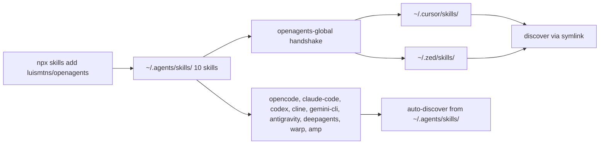
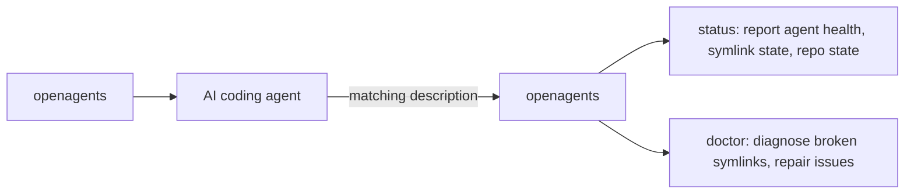
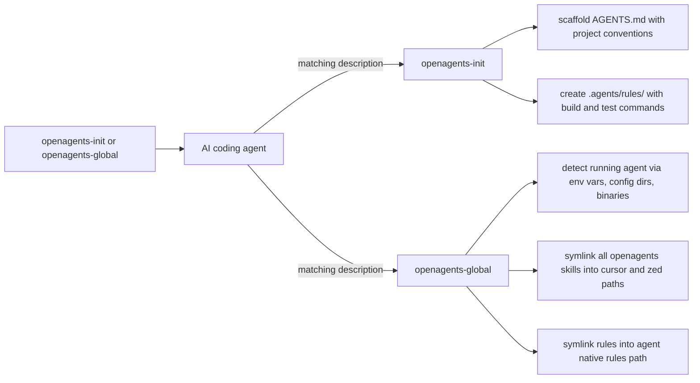
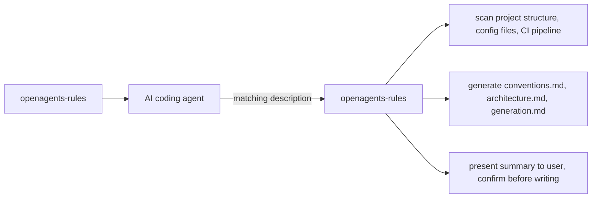
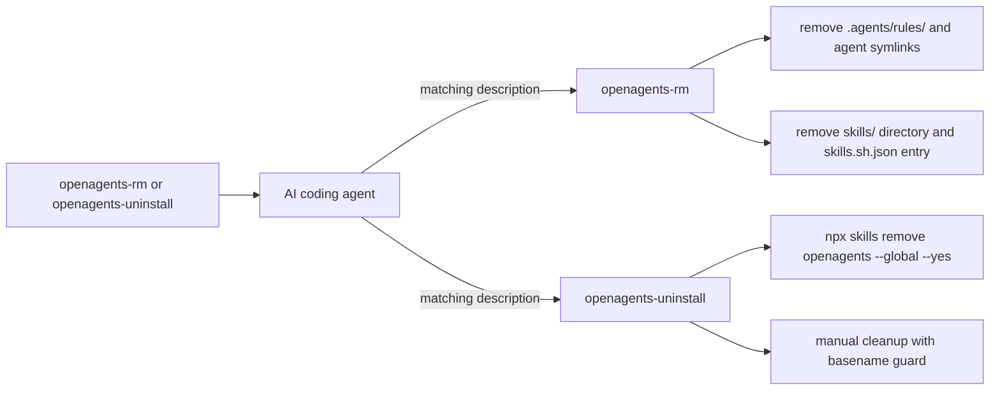

<h1 align="center">
  
</h1>

[](https://skills.sh/luismtns/openagents)
[](https://github.com/luismtns/openagents/actions/workflows/validate.yml)
[](https://github.com/luismtns/openagents/actions/workflows/publish.yml)
[](https://github.com/luismtns/openagents/releases/latest)
[](https://www.skills.sh/luismtns/openagents/openagents/security/socket)
[](https://www.skills.sh/luismtns/openagents/openagents/security/snyk)

A multi-skill orchestration suite for AI coding agents. Each subcommand is
an independent discoverable skill. Agents auto-discover them by name
and activate only the specific skill needed.

## How it works

openagents gives you **one unified setup of skills and rules for every AI
agent you use**. Install once in `~/.agents/skills/` and every compatible
agent discovers them automatically. Agents that do not auto-discover
`~/.agents/skills/` get symlinks from their native paths via `openagents-global`.

### Installation and discovery



### Hub



### Setup



### Codebase analysis



### Cleanup



## Installation

```bash
# Via skills.sh
npx skills add luismtns/openagents

# Via skill.fish
npx skillfish add luismtns/openagents
```

Then load in any AI coding agent:

```
# opencode
skill({ name: "openagents" })       # hub: status + doctor
skill({ name: "openagents-init" })  # project scaffolding
skill({ name: "openagents-global" }) # handshake + symlinks

# claude-code
/openagents:init   # as plugin
/openagents-init   # as standalone skill

# cursor or zed
/openagents-init
```

## Subcommands

| Invocation | Skill | What it does | When to use |
|------------|-------|-------------|-------------|
| `openagents` | openagents | Shows agent status, repo health, available commands | Default entry point, checking current setup |
| `openagents-global` | openagents-global | Detects running agent, verifies multi-agent ecosystem, creates symlinks | First-time setup, checking agent configurations |
| `openagents-init` | openagents-init | Generates AGENTS.md, detects language and framework, creates `.agents/rules/` | Starting a new project, onboarding |
| `openagents-add` | openagents-add | Scaffolds new skills, registers distribution, validates structure | Creating a new skill or rule pack |
| `openagents-rules` | openagents-rules | Deep codebase scan, pattern identification, rule generation | When a project needs thorough rule coverage |
| `openagents-rm` | openagents-rm | Removes rules, skills, AGENTS.md, symlinks, or all project artifacts | Cleaning up project scaffolding |
| `openagents-doctor` | openagents-doctor | Diagnose and repair broken symlinks, missing files, version mismatches | When status shows issues or setup seems broken |
| `openagents-info` | openagents-info | Shows version, installed sub-skills, detected agents, distribution channels | Checking what is installed and configured |
| `openagents-upgrade` | openagents-upgrade | Runs `npx skills update` to fetch latest version | Updating to the newest release |
| `openagents-uninstall` | openagents-uninstall | Uninstalls the openagents skill via `npx skills remove` | Removing the skill from your ecosystem |

## Agent compatibility

| Agent | Skill discovery | Auto-discover `~/.agents/skills/` |
|-------|----------------|-----------------------------------|
| opencode | `~/.agents/skills/` | Yes |
| claude-code | `~/.agents/skills/` | Yes |
| codex | `~/.agents/skills/` | Yes |
| cursor | `~/.cursor/skills/` symlink | No |
| cline | `~/.agents/skills/` | Yes |
| zed | `~/.zed/skills/` symlink | No |
| antigravity | `~/.agents/skills/` | Yes |
| deepagents | `~/.agents/skills/` | Yes |
| gemini-cli | `~/.agents/skills/` | Yes |
| github-copilot | `~/.agents/skills/` | Yes |
| kimi-code-cli | `~/.agents/skills/` | Yes |
| mimocode | `~/.local/share/mimocode/` plugin-based | No |
| warp | `~/.agents/skills/` | Yes |
| amp | `~/.agents/skills/` | Yes |

## Project structure

```
skills/
├── openagents/                    # Hub: status + doctor + detection matrix
│   ├── SKILL.md
│   └── references/
│       └── status.md
├── openagents-global/             # Handshake + symlinks
│   └── SKILL.md
├── openagents-init/               # Project scaffolding
│   └── SKILL.md
├── openagents-add/                # Create skills/rules
│   └── SKILL.md
├── openagents-rules/              # Codebase analysis
│   ├── SKILL.md
│   └── references/
│       ├── scan.md
│       ├── generate.md
│       └── validate.md
├── openagents-rm/                 # Remove artifacts
│   └── SKILL.md
├── openagents-doctor/             # Diagnose + repair
│   └── SKILL.md
├── openagents-info/               # Version + channels
│   └── SKILL.md
├── openagents-upgrade/            # Self-update
│   └── SKILL.md
└── openagents-uninstall/          # Global uninstall
    └── SKILL.md

.agents/rules/
├── validate.md               # Pre-release validation
├── distributed-skills.md     # Naming, layout, ecosystem distribution
└── agentskills.md            # Canonical Agent Skills references (base source)

scripts/
├── validate.sh               # Local CI validator
├── clean.sh                  # Global skill cleanup
└── publish.sh                # Release gate: skills-ref + skills.sh publish

AGENTS.md                     # Skill pack documentation
CHANGELOG.md                  # Version history
skills.sh.json                # skills.sh distribution config (10 skills)
```

## Development

```bash
# Validate locally
bash scripts/validate.sh

# Full cleanup (removes all global skills, npm/npx cache)
bash scripts/clean.sh

# Reinstall after changes
bash scripts/clean.sh && npx skills add luismtns/openagents -y -g
```