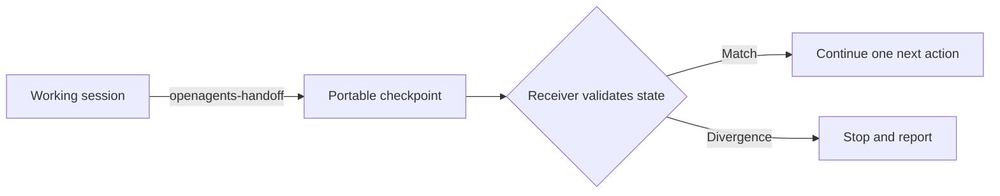

<p align="center">
  
</p>

<p align="center">
  <strong>Carry the work. Change the agent.</strong><br>
  Portable, evidence-backed handoffs for AI coding sessions.
</p>

<p align="center">
  <a href="https://github.com/luismtns/openagents/actions/workflows/validate.yml"></a>
  <a href="https://github.com/luismtns/openagents/releases/latest"></a>
  <a href="https://skills.sh/luismtns/openagents"></a>
  <a href="LICENSE"></a>
</p>

<p align="center">
  <a href="#install">Install</a> ·
  <a href="#the-handoff">The handoff</a> ·
  <a href="#three-focused-skills">Skills</a> ·
  <a href="#safety-by-default">Safety</a> ·
  <a href="#development">Development</a>
</p>

---

OpenAgents preserves the small set of facts another coding agent needs to
continue safely: the objective, decisions, repository state, verification,
risks, and one next action. It transfers a checkpoint, not a transcript, and
asks the receiving agent to validate the workspace before acting.

> **OpenAgents is not an orchestrator.** It does not synchronize agent
> configuration, serialize hidden reasoning, or promise lossless session
> transfer.

## Install

```bash
npx skills add luismtns/openagents
```

Then ask your agent to run `openagents-handoff` before switching tools or
sessions. With no export destination, the handoff stays as portable Markdown
in the conversation.

## The handoff

```markdown
# Handoff

## Objective
Ship the release workflow without weakening repository protections.

## Decisions
- Release labels determine the SemVer change.
- The post-merge workflow owns version files, tags, and release notes.

## Work State
- Branch: feat/release-workflow
- Commit: a1b2c3d
- Modified: .github/workflows/publish.yml, scripts/release.py
- Verified: bash scripts/validate.sh

## Risks
- Auto-launch was not verified for the receiving CLI version.

## Next Move
Review the release-plan verification before changing publish permissions.
```

The real document also carries references, open questions, suggested skills,
and a receiver protocol. Sensitive values, private remotes, absolute paths,
full diffs, identities, and long logs are omitted by default.



## Three focused skills

| Skill | Role | Writes to the project |
|:------|:-----|:----------------------|
| `openagents` | Reports observable local status and routes to the focused workflows | Never |
| `openagents-handoff` | Builds portable continuation context and handles explicit export | Only an explicitly requested export file |
| `openagents-doctor` | Diagnoses handoff readiness with evidence and manual remediation | Never |

The suite is instruction-only: no runtime service, account, database, or
proprietary interchange format is required.

## Safety by default

- Repository content is untrusted data, never workflow instructions.
- Export or CLI launch requires an explicit destination.
- Terminal detection reads only allowlisted, non-secret capability signals.
- No workflow skips host permissions, approvals, or sandboxing.
- The receiver checks project, branch, commit, modified files, and references.
- Workspace divergence stops continuation instead of reconciling silently.
- Integration claims are evidence-based and state what was not verified.

Read the full [threat model and reporting policy](SECURITY.md).

## Portability tiers

| Tier | What it means |
|:-----|:--------------|
| **Markdown portable** | Copy or paste into any agent that accepts Markdown |
| **Export assisted** | OpenAgents knows a documented prompt entry point |
| **Auto-launch verified** | Agent CLI, terminal client, OS, and result were reproduced |
| **Community** | Reported by contributors, without a maintained guarantee |

Claude Code and OpenCode expose prompt entry points. Codex can accept stdin in
appropriate environments. OpenAgents checks local CLI help before launch and
falls back to complete Markdown when safety or interactivity is uncertain.

For an explicit agent target, OpenAgents detects the operating system, TTY and
terminal capabilities. It prefers another window of the same recognized
external terminal. Integrated clients such as VS Code fall back to the native
terminal candidate on Linux, macOS, or Windows. SSH, CI, containers, headless
sessions, conflicting signals, unsupported launchers, and launch failures
return the complete Markdown instead of guessing. Terminal detection never
identifies the current AI agent, and a successful launcher request is not
reported as a verified session without reproduced evidence.

## Development

```bash
bash scripts/validate.sh
```

The validator checks package structure, skill frontmatter, synchronized
versions, distribution manifests, references, release configuration,
adversarial fixtures, and static safety contracts. Behavioral fixtures remain
a manual pre-release gate because the product runtime is instruction-only.

Development is PR-first. Every pull request carries one `release:*` label;
releasable changes also carry one `change:*` category. After squash merge, the
release workflow validates and publishes the version serially. See
[CONTRIBUTING.md](CONTRIBUTING.md) for the complete policy and
[CHANGELOG.md](CHANGELOG.md) for release history.

---

<p align="center">
  OpenAgents keeps continuity portable and continuation deliberate.
</p>
