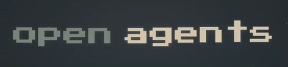

<h1 align="center">
  
</h1>

[](https://skills.sh/luismtns/openagents)
[](https://github.com/luismtns/openagents/actions/workflows/validate.yml)
[](https://github.com/luismtns/openagents/actions/workflows/publish.yml)
[](https://github.com/luismtns/openagents/releases/latest)

Multi-agent workflow orchestration for AI coding agents.

A single distributable skill that detects your agent, adapts to it, and
orchestrates multi-agent workflows across your ecosystem.

## How it works

```mermaid
flowchart TD
    User{User says...} -->|"setup multi-agent"| Skill[skill{ name: openagents }]
    User -->|"init project"| Skill
    User -->|"create skill"| Skill
    User -->|"analyze & rules"| Skill

    Skill --> Router[SKILL.md Router]

    Router -->|global| Global[references/global.md]
    Router -->|init| Init[references/init.md]
    Router -->|add| Add[references/add.md]
    Router -->|rules| Rules[references/rules.md]

    Global --> Detect{Detect Agent}
    Detect -->|opencode| OC[~/.config/opencode/]
    Detect -->|claude-code| CC[~/.claude/]
    Detect -->|codex| CX[~/.codex/]
    Detect -->|cursor| CR[~/.cursor/skills/]
    Detect -->|cline| CL[~/.clinerules]
    Detect -->|zed| ZD[~/.zed/]

    Init --> Lang[Detect language]
    Lang --> Gen[Generate AGENTS.md]
    Gen --> RulesDir[Create .agents/rules/]

    Add --> Scaffold[Scaffold SKILL.md]
    Scaffold --> Register[Register skills.sh.json]

    Rules --> Scan[Scan codebase]
    Scan --> Patterns[Identify patterns]
    Patterns --> GenRules[Generate rules]
    GenRules --> Validate[Validate with user]
```

## Installation

```bash
npx skills add luismtns/openagents
```

Then load in any AI coding agent:

```
skill({ name: "openagents" })
```

## Subcommands

| Subcommand | What it does | When to use |
|------------|-------------|-------------|
| `openagents:global` | Detects the running agent, maps config paths, verifies the multi-agent ecosystem | First-time setup, checking agent configurations |
| `openagents:init` | Generates AGENTS.md, detects language/framework, creates `.agents/rules/` | Starting a new project, onboarding |
| `openagents:add` | Scaffolds new skills, registers distribution, validates structure | Creating a new skill or rule pack |
| `openagents:rules` | Deep codebase scan, pattern identification, rule generation | When a project needs thorough rule coverage |

## Agent compatibility

| Agent | Skill discovery | Auto-discover `~/.agents/skills/` |
|-------|----------------|-----------------------------------|
| opencode | `~/.agents/skills/` | Yes |
| claude-code | `~/.agents/skills/` | Yes |
| codex | `~/.agents/skills/` | Yes |
| cursor | `~/.cursor/skills/` (symlink) | No |
| cline | `~/.agents/skills/` | Yes |
| zed | `~/.zed/skills/` (symlink) | No |

## Project structure

```
skills/openagents/
├── SKILL.md                  # Unified frontmatter + routing table
└── references/
    ├── global.md             # Agent-agnostic handshake protocol
    ├── init.md               # Project scaffolding
    ├── add.md                # Skill/rules creation
    └── rules.md              # Deep analysis + rule generation

.agents/rules/
├── validate.md               # Pre-release validation
└── distributed-skills.md     # Naming and layout conventions

scripts/
├── validate.sh               # Local CI validator
└── clean.sh                  # Global skill cleanup

AGENTS.md                     # Root-level skill pack description
CHANGELOG.md                  # Version history
skills.sh.json                # skills.sh distribution config
```

## Development

```bash
# Validate locally
bash scripts/validate.sh

# Reinstall after changes
bash scripts/clean.sh && npx skills add luismtns/openagents
```
