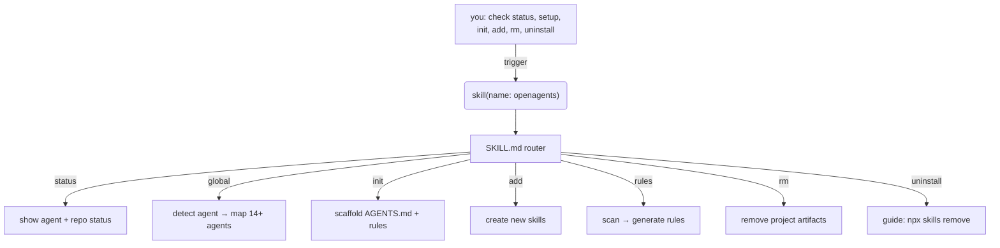

<h1 align="center">
  
</h1>

[](https://skills.sh/luismtns/openagents)
[](https://github.com/luismtns/openagents/actions/workflows/validate.yml)
[](https://github.com/luismtns/openagents/actions/workflows/publish.yml)
[](https://github.com/luismtns/openagents/releases/latest)
[](https://www.skills.sh/luismtns/openagents/openagents/security/socket)
[](https://www.skills.sh/luismtns/openagents/openagents/security/snyk)

Multi-agent workflow orchestration for AI coding agents.

A single distributable skill that detects your agent, adapts to it, and
orchestrates multi-agent workflows across your ecosystem.

## How it works



## Installation

```bash
npx skills add luismtns/openagents
```

Then load in any AI coding agent:

```
skill({ name: "openagents" })
```

## Subcommands

| Subcommand | What it does | When to use |
|------------|-------------|-------------|
| `openagents` / `openagents status` | Shows agent status, repo status, available commands, and next steps | Default entry point, checking current setup |
| `openagents global` | Detects the running agent, maps config paths, verifies the multi-agent ecosystem | First-time setup, checking agent configurations |
| `openagents init` | Generates AGENTS.md, detects language/framework, creates `.agents/rules/` | Starting a new project, onboarding |
| `openagents add` | Scaffolds new skills, registers distribution, validates structure | Creating a new skill or rule pack |
| `openagents rules` | Deep codebase scan, pattern identification, rule generation | When a project needs thorough rule coverage |
| `openagents rm` | Removes rules, skills, AGENTS.md, symlinks, or all project artifacts | Cleaning up project scaffolding |
| `openagents uninstall` | Uninstalls the openagents skill via `npx skills remove` | Removing the skill from your ecosystem |

## Agent compatibility

| Agent | Skill discovery | Auto-discover `~/.agents/skills/` |
|-------|----------------|-----------------------------------|
| opencode | `~/.agents/skills/` | Yes |
| claude-code | `~/.agents/skills/` | Yes |
| codex | `~/.agents/skills/` | Yes |
| cursor | `~/.cursor/skills/` (symlink) | No |
| cline | `~/.agents/skills/` | Yes |
| zed | `~/.zed/skills/` (symlink) | No |
| antigravity | `~/.agents/skills/` | Yes |
| deepagents | `~/.agents/skills/` | Yes |
| gemini-cli | `~/.agents/skills/` | Yes |
| github-copilot | `~/.agents/skills/` | Yes |
| kimi-code-cli | `~/.agents/skills/` | Yes |
| mimocode | `~/.local/share/mimocode/` (plugin-based) | No |
| warp | `~/.agents/skills/` | Yes |
| amp | `~/.agents/skills/` | Yes |

## Project structure

```
skills/openagents/
├── SKILL.md                  # Unified frontmatter + routing table
└── references/
    ├── status.md             # Default status workflow
    ├── global.md             # Agent-agnostic handshake protocol
    ├── init.md               # Project scaffolding
    ├── add.md                # Skill/rules creation
    ├── rules.md              # Deep analysis + rule generation
    ├── rm.md                 # Remove project artifacts
    └── uninstall.md          # Uninstall guidance

.agents/rules/
├── validate.md               # Pre-release validation
└── distributed-skills.md     # Naming and layout conventions

scripts/
├── validate.sh               # Local CI validator
└── clean.sh                  # Global skill cleanup

AGENTS.md                     # Root-level skill pack description
CHANGELOG.md                  # Version history
skills.sh.json                # skills.sh distribution config
```

## Development

```bash
# Validate locally
bash scripts/validate.sh

# Full cleanup (removes all global skills, npm/npx cache)
bash scripts/clean.sh

# Reinstall after changes
bash scripts/clean.sh && npx skills add luismtns/openagents -y -g
```
